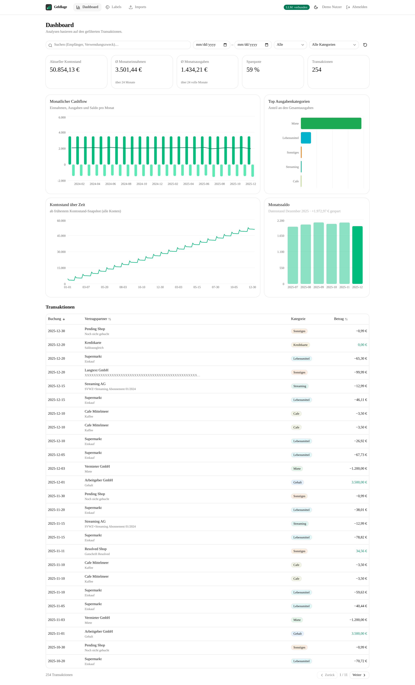
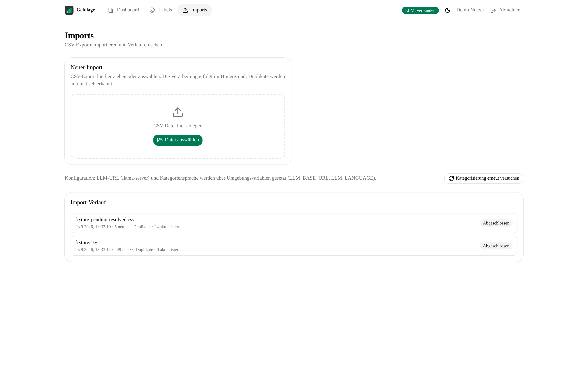
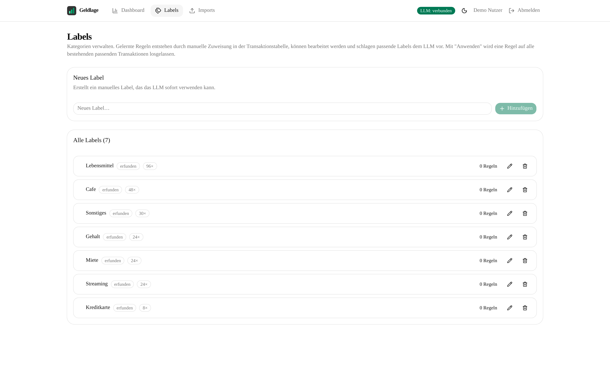

# DKB Analytics

Next.js app for analyzing DKB banking CSV exports: import via drag-and-drop,
automatic categorization through a local LLM (llama.cpp `llama-server`), manual
label management with learned counterparty rules, and analytics (balance,
monthly cash flow, savings rate, top categories) that always reflect the
filtered query results.

| Dashboard                                                                                                | Imports                                                                             |
| -------------------------------------------------------------------------------------------------------- | ----------------------------------------------------------------------------------- |
|  |  |

All screenshots show data from a synthetic dataset generated by
`scripts/generate-fixture.ts` — no real bank data.

## Setup

```bash
bun install
make dev   # offers the model download on first run, then starts everything
```

`make dev` (and `make app`) also bring up the **dev OIDC provider** the login
requires: a throwaway Authentik stack in Docker
([compose.dev.yaml](compose.dev.yaml), `127.0.0.1:8081`), with the app's OIDC
client provisioned automatically. Its credentials live in `compose.dev.env`
(gitignored — created from `compose.dev.env.example` on first `make oidc`;
login is `akadmin` / your `AUTHENTIK_BOOTSTRAP_PASSWORD`). The stack is bound
to localhost only and must never be exposed to other network hosts.
Different usernames test multi-user provisioning. `make dev` tears down on
exit what it started itself (llama-server and, if it started the stack, the
OIDC containers — the provisioned client survives in the `authentik-db`
named volume); a pre-existing llama-server or OIDC stack is left running.
`make stop` / `make oidc-down` remove the containers explicitly (volume kept,
so the next `make oidc` is fast). `.env` is preconfigured for this provider:

```bash
OIDC_ISSUER_URL=http://localhost:8081/application/o/dkb-analytics/
OIDC_CLIENT_ID=dkb-analytics
OIDC_CLIENT_SECRET=dev-only-not-secret-32-chars-min!!
```

## Documentation

Extensive documentation lives in [`docs/`](docs/README.md): architecture,
data model, CSV import, labelling, analytics, frontend, API reference,
operations, and testing — plus every design decision as an ADR
([docs/README.md](docs/README.md) is the index, with a German–English
glossary of the DKB domain terms).

### LLM backend (llama-server)

The labeller talks OpenAI-compatible chat completions to a local
[llama.cpp `llama-server`](https://github.com/ggml-org/llama.cpp). `make dev`
starts it in the background and runs the app in the foreground; on exit it
tears down what it started (llama-server, and the OIDC containers if it
started those too). `make stop` stops llama-server and removes the OIDC
containers (explicit teardown — it doesn't track who started what);
`make llm-status` shows health + GPU usage.

**Model download (no Ollama):** `make model` downloads one exact GGUF file
from Hugging Face with a pinned revision (`ggml-org/Qwen3.8-27B-GGUF`,
`Qwen3.8-27B-Q4_K_M.gguf`, ~18 GB) into `models/` and records the path in
`.llm-model`. The download is resumable — re-run `make model` after an
interrupted transfer. A different quant/repo can be selected via override:

```bash
make model MODEL_HF_REPO=unsloth/Qwen3.8-27B-GGUF MODEL_HF_FILE=Qwen3.8-27B-UD-Q4_K_M.gguf MODEL_HF_REVISION=
```

An empty `MODEL_HF_REVISION` tracks the repo's default branch; omitting the
override keeps the pinned `ggml-org` revision (a different repo's history
usually doesn't contain it — pass `MODEL_HF_REVISION=` when switching repos).

Gated repos need a token: `HF_TOKEN=hf_xxx make model`. Any local GGUF works
too: `make llm MODEL=/path/to/model.gguf`.

The Makefile auto-detects GPU support via `--list-devices`: a CUDA/Vulkan/
ROCm-capable llama-server runs with GPU offload, a CPU-only build runs on
CPU with a warning (slow but functional). On Arch:
`pacman -S llama-cpp ggml-cuda ggml-cpu`. To opt into Ollama's vendored
GPU-capable llama-server instead, create `Makefile.local`:

```make
LLAMA_SERVER = /usr/lib/ollama/llama-server
LLAMA_ENV = GGML_BACKEND_PATH=/usr/lib/ollama/cuda_v13/libggml-cuda.so LD_LIBRARY_PATH=/usr/lib/ollama/cuda_v13
```

Start llama-server by hand instead:

```bash
llama-server -m <model.gguf> \
  -c 8192 -np 1 -fa on -ctk q8_0 -ctv q8_0 \
  -ngl auto --fit on --reasoning off \
  --host 127.0.0.1 --port 8080 --no-webui
```

`--reasoning off` disables thinking (mandatory for thinking models —
otherwise the token budget is burned before any label is produced).

Environment (all optional):

| Variable                | Default                 | Purpose                                                          |
| ----------------------- | ----------------------- | ---------------------------------------------------------------- |
| `DATABASE_PATH`         | `./data/dkb.db`         | SQLite database file                                             |
| `LLM_BASE_URL`          | `http://127.0.0.1:8080` | llama-server base URL                                            |
| `LLM_LANGUAGE`          | `de`                    | ISO 639-1 label language                                         |
| `LLM_BATCH_SIZE`        | `20`                    | max items per LLM request                                        |
| `LLM_MAX_RETRIES`       | `2`                     | retries for transient LLM failures                               |
| `LLM_TIMEOUT_MS`        | `300000`                | per-request timeout (hybrid models are slow)                     |
| `LLM_CTX`               | `8192`                  | llama-server context window used by the client-side budget guard |
| `LLM_MAX_ATTEMPTS`      | `5`                     | per-transaction labeling attempt cap                             |
| `LLM_MAX_LABELS_PROMPT` | `200`                   | max existing labels injected into the prompt                     |
| `OIDC_ISSUER_URL`       | — (required)            | OIDC issuer URL (any compliant provider)                         |
| `OIDC_CLIENT_ID`        | — (required)            | OIDC client id                                                   |
| `OIDC_CLIENT_SECRET`    | — (required)            | OIDC client secret                                               |
| `OIDC_SCOPES`           | `openid profile email`  | requested scopes                                                 |
| `SESSION_TTL_SECONDS`   | `604800`                | session cookie lifetime (7 days)                                 |
| `SESSION_SECRET`        | client secret fallback  | HS256 session-cookie key (min 32 chars)                          |
| `APP_ORIGIN`            | derived from request    | public origin behind a reverse proxy                             |

Raising `LLM_BATCH_SIZE` substantially (> ~40) can make the completion
budget exceed the server's context window (`-c` in `make llm`, 8192 by
default) once prompt + completion are summed — output gets clamped and
JSON truncates. When that happens the client logs a warning once per
affected request; keep batch size moderate or raise `LLM_CTX` on both
sides — the server flag (`make llm LLM_CTX=…`) and the app's environment
(the client-side guard reads the same variable at startup).

## Labelling

A background worker claims pending transactions in small batches, asks
llama-server for labels, and marks the batch completed once every row is
labeled or exhausted its attempts. A lightweight health gate prevents an LLM
outage from burning attempt budgets. There are **no fallback labels**: rows
the model could not label end up `failed` ("ohne Kategorie") and are retried
on their next claimable tick or via the retry button on the Imports page.

**Label rules (suggestions):** manually assigning a label to a transaction in
the transactions table learns a rule from its exact (payer, payee, counterparty
IBAN) combination → label. Future transactions matching all three verbatim
receive the rule's label as a suggestion in the prompt; the LLM decides but
must reuse a fitting suggestion verbatim. This gives consistent labels for
recurring counterparties while the LLM stays in the loop for everything else.

**Label management (`/labels` page):**



- Create, rename and delete labels; usage counts and origin are shown
  (`manuell` = user-created/renamed/assigned, `erfunden` = invented by the LLM)
- Deleting a label resets its transactions to pending — the worker re-labels
  them with the LLM — and removes its learned rules
- Learned rules are listed per label and can be deleted individually

Re-importing the same or overlapping exports deduplicates automatically —
transactions are never deleted.

## Docker

Images are built and pushed to GHCR by the release workflow
(`.github/workflows/release.yml`) after QA passes — one tag per release:

```
ghcr.io/j-stechmann/dkb-analytics:<release-tag>   e.g. ghcr.io/j-stechmann/dkb-analytics:v0.0.1
```

All configuration is read from the environment at runtime, so no rebuild is
needed to point the app at your llama-server or database. Use a named volume
for the database directory (bind mounts don't pick up the image's directory
ownership and will hit permission errors unless host uid matches):

```yaml
services:
  app:
    image: ghcr.io/j-stechmann/dkb-analytics:v0.0.1
    ports:
      - "3000:3000"
    environment:
      DATABASE_PATH: /app/data/dkb.db
      LLM_BASE_URL: http://llama-server:8080 # llama-server on the compose network
      OIDC_ISSUER_URL: https://id.example.com # required: your OIDC provider
      OIDC_CLIENT_ID: dkb-analytics # required
      OIDC_CLIENT_SECRET: <secret> # required
      APP_ORIGIN: https://dkb.example.com # public origin (behind reverse proxy)
      # LLM_LANGUAGE: de                     # optional, defaults in lib/config.ts
      # LLM_BATCH_SIZE: "100"
      # LLM_MAX_RETRIES: "2"
    volumes:
      - dkb-data:/app/data # required: SQLite db + WAL are written at runtime

  llama-server:
    image: ghcr.io/ggml-org/llama.cpp:server
    environment:
      LLAMA_ARG_HF_REPO: <user>/<model>-GGUF:Q4_K_M
      LLAMA_ARG_CTX_SIZE: "8192"
      LLAMA_ARG_N_PARALLEL: "1"
      LLAMA_ARG_FLASH_ATTN: "on"
      LLAMA_ARG_CACHE_TYPE_K: q8_0
      LLAMA_ARG_CACHE_TYPE_V: q8_0
      LLAMA_ARG_HOST: 0.0.0.0
      LLAMA_ARG_PORT: "8080"
    volumes:
      - llama-models:/models

volumes:
  dkb-data:
  llama-models:
```

The database schema is created automatically on first boot.

## Login & multi-user

Login is **mandatory** ([ADR-0032](docs/adr/adr-0032-multi-user-oidc.md)):
the app talks to any OIDC-compliant provider (Keycloak, Authentik, Authelia,
Pocket ID, …) via issuer discovery and authorization-code + PKCE. Users are
provisioned automatically on first login — each user sees **only their own**
accounts, imports, transactions, labels and learned rules. The v1 → v2
migration starts everyone empty (pre-user data cannot be attributed to an
owner). Configure your provider's redirect URI as
`<APP_ORIGIN>/auth/callback`.

In dev, `make dev`/`make app` start a local Authentik for this (see Setup);
log in as `akadmin` or any user you create in its admin UI
(`http://localhost:8081/if/admin/`) to see per-user isolation. Note the app
only allows plain-HTTP issuers (`http://…`) — a provider behind HTTPS always
works; for production, put TLS in front of Authentik or the reverse proxy.

**HTTPS in front of the app is mandatory for any deployment beyond
localhost.** Without TLS, anyone on the same network can read sessions and
bank data and can inject scripts into served pages; the app logs a loud
startup warning when `APP_ORIGIN` is set and not `https://` (so always set
`APP_ORIGIN` behind a proxy). See
[docs/operations.md](docs/operations.md#security--privacy-posture).

## Correctness

All amounts are stored as integer cents and verified by a test suite that
includes property-based round-trips (20k random amounts), a synthetic
24-month fixture with a hand-computed KPI manifest asserted **to the cent**
through the real HTTP API, and dedupe/labeller edge cases:

```bash
bunx vitest run
```
