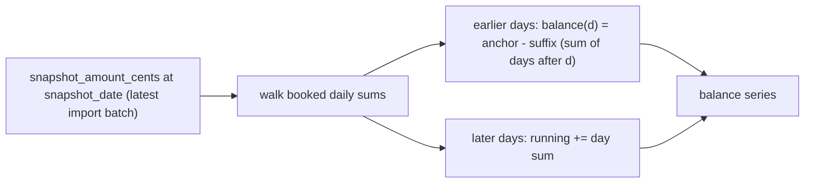

# Analytics

_Last reviewed against v1.8.0._

All KPIs, charts, and the transactions table are computed from **one shared
filter pipeline** ([lib/analytics/queries.ts](../lib/analytics/queries.ts)),
with aggregation in SQL (SQLite, via drizzle `sql` fragments) and
month-windowing/balance math in JavaScript
([lib/analytics/engine.ts](../lib/analytics/engine.ts)). The dashboard always
reflects the filtered query results — with two deliberate exceptions
(balances and savings history, see below).

## Filters

`parseFilters()` → `buildWhere()` build the shared WHERE clause from query
params: free text (escaped LIKE over `payee`/`payer`/`purpose`), date range
on `booking_date`, type (`Ausgang`/`Eingang`), category ids (repeated
param), account, label status, and status (`Gebucht` unless `status=all`).
All list values are allow-listed; sort keys are restricted to
`amount_cents / payee / booking_date`. The client serializes the same filter
state into query params ([frontend.md](frontend.md)).

`todayLocal()` ([lib/analytics/date.ts](../lib/analytics/date.ts)) returns
the local-calendar date — deliberately **not** `new Date().toISOString()`,
which would shift month boundaries for non-UTC timezones.

## Monthly cash flow

One grouped SQL query: `month = substr(booking_date, 1, 7)` (the ISO TEXT
format makes this trivial), `income = SUM(CASE WHEN amount_cents > 0 …)`,
`expenses = SUM(-amount_cents WHERE amount_cents < 0)`. JavaScript zero-fills
months between the first and last booking month so the chart has no gaps;
`net = income − expenses` per month.

## Averages and savings rate

Only **full months** count ([ADR-0022](adr/adr-0022-balance-back-calculation.md)
companion rule):

- If data reaches into the current month, the current month is excluded.
- A `dateTo` before the month's last day makes that month partial → excluded.
- A `dateFrom` after the 1st makes the first month partial → excluded.
- `avgIncome = round(sumIncome / monthsCounted)` (same for expenses);
- `savingsRate = (avgIncome − avgExpenses) / avgIncome` — null when
  `avgIncome ≤ 0` or no data; rendered as a percentage.

## Top categories

SQL grouped by `category_id`, **expenses only** (`amount_cents < 0`), ordered
by `SUM(-amount_cents) DESC`, top 12; the share of total expenses is computed
in JS. The `null` category bucket is named "Unlabeled" and colored gray;
every other category gets a stable color from the golden-ratio oklch palette
([frontend.md](frontend.md)).

## Savings history (Monatssaldo)

The last **6 complete months** of `income − expenses`, deliberately scoped
**by time only**: text search, type, category, label-status, and `dateFrom`
filters are stripped from the scope (account id is kept) — content filters
would fragment the month series. The running month is computed separately and
rendered as a dashed "laufender Monat" bar. A staleness flag marks the last
complete month as stale when no new import covers it.

## Balance timeline (back-calculation)

DKB exports carry a `Kontostand` snapshot at the _end_ of the export period —
not per-transaction running balances. The timeline is therefore
**back-calculated from the anchor** ([ADR-0022](adr/adr-0022-balance-back-calculation.md)):

- Anchor: the latest `snapshot_amount_cents` across all import batches for
  the account.
- Days **before** the snapshot: `balance(d) = anchor − Σ(bookings in
(d, anchorDate])` — the suffix accumulates backward.
- Days **after**: the running sum accumulates forward.
- No snapshot → cumulative sum from zero, flagged `balanceWithoutSnapshot`.
- The `currentBalanceCents` KPI is read from the _unfiltered_ series so an
  empty visible window still yields a value; when `dateTo` precedes all
  data, `balance(dateTo) = anchor − Σ(bookings in (dateTo, anchorDate])`.

**Why balance and savings history ignore content filters:** both derive from
a _cumulative_ quantity. Filtering to " groceries in March " would break the
suffix math (the anchor includes all transactions) and produce meaningless
"balances". Time scoping (date range, account) is safe and preserved. This
is the single most common source of "why doesn't the chart match my filter?"
questions — the answer is that the chart would be wrong otherwise.

## Chart integration

The dashboard renders cash flow, categories, balance, and savings via
Recharts inside shadcn `ChartContainer`s; time-series charts get
pinch/wheel-zoom and drag-pan through the custom
[hooks/use-chart-zoom.ts](../hooks/use-chart-zoom.ts) (a `resetKey` resets
the zoom window when the dataset changes). See
[frontend.md](frontend.md) for the client details.

## Correctness

The analytics engine is verified **to the cent** against a generated
24-month fixture with a hand-computed KPI manifest — a second, independent
implementation of the same formulas (see [testing.md](testing.md) and
[ADR-0020](adr/adr-0020-property-tests-money.md) for the testing posture).
