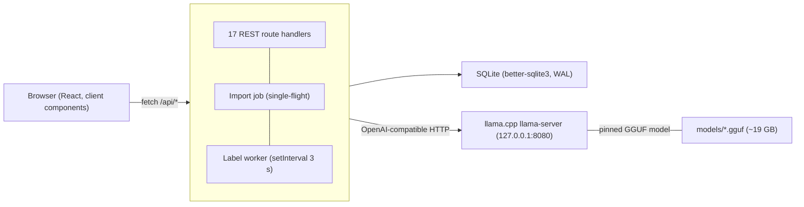
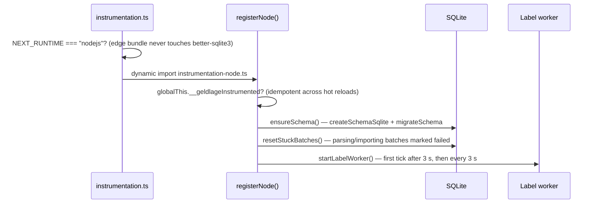
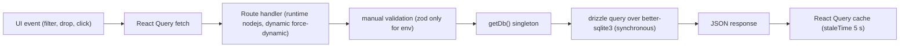

# Architecture

_Last reviewed against v1.9.0. Docs describe intent; code comments remain the source of truth._

Geldlage is a **single-process, local-first web application**: one Node
process serves the Next.js UI, the REST API, a background import job, and a
background labeling worker — all reading and writing one SQLite database, and
talking to one local llama.cpp `llama-server` for transaction categorization.
There is no queue, no Redis, no second service. Access is gated by mandatory
OIDC authentication with per-user data isolation (see
[ADR-0032](adr/adr-0032-multi-user-oidc.md), superseding the no-auth posture
of [ADR-0031](adr/adr-0031-no-auth-local-first-privacy.md)).

## System overview

- **Browser** — three client-rendered pages (`/`, `/imports`, `/labels`);
  all data flows through React Query (see [frontend.md](frontend.md)). Login
  is mandatory: `proxy.ts` redirects unauthenticated page requests to
  `/auth/login` and returns 401 JSON for `/api/*` ([ADR-0032](adr/adr-0032-multi-user-oidc.md)).
- **Next.js server** — route handlers under `app/api/**`, all
  `runtime = "nodejs"` + `dynamic = "force-dynamic"`
  (see [ADR-0025](adr/adr-0025-manual-api-validation.md) and [api.md](api.md)).
- **SQLite** — better-sqlite3 with WAL, synchronous access, drizzle-orm as a
  query builder (see [data-model.md](data-model.md) and
  [ADR-0004](adr/adr-0004-better-sqlite3-wal-singleton.md)).
- **llama-server** — local llama.cpp server, OpenAI-compatible chat
  completions with grammar-constrained decoding
  (see [labelling.md](labelling.md) and
  [ADR-0012](adr/adr-0012-local-llama-server.md)).

## Process model

Everything runs **in one Node process**. The two background jobs are plain
in-process loops, not external workers:

| Job          | Scheduling                                                                      | Guard                                                                            | Code                                                |
| ------------ | ------------------------------------------------------------------------------- | -------------------------------------------------------------------------------- | --------------------------------------------------- |
| Import job   | fire-and-forget promise from `POST /api/imports`                                | single-flight flag `globalThis.__geldlageImportJob`                                   | [lib/import/pipeline.ts](../lib/import/pipeline.ts) |
| Label worker | `setInterval(tick, 3000)` + initial `setTimeout(tick, 3000)`, both `.unref()`ed | re-entry guard `workerState().ticking` + `globalThis.__geldlageLabellerWorkerStarted` | [lib/labeller/worker.ts](../lib/labeller/worker.ts) |

Both loops are keyed off `globalThis` so Next.js dev hot-reloads cannot start
duplicates ([ADR-0008](adr/adr-0008-in-process-workers-globalthis.md)). The
label worker reads the import job's flag directly (`worker.ts:98-105`) — a
tick is skipped while an import is running, so import reconciliation and LLM
labeling never interleave. The worker's reliability protocol (claim-time
attempts, health gate, drain detection) is codified in
[ADR-0009](adr/adr-0009-worker-reliability-protocol.md).

Why no external queue/worker process: the app is a local single-user tool;
SQLite writes are fast enough that an in-process loop with a 3 s cadence keeps
labels within seconds of an import, and a second process would need IPC plus a
second deployment artifact. The tradeoff — labeling blocks the same event
loop as the UI API — is mitigated by better-sqlite3's synchronous, fast
access and by `LLM_BATCH_SIZE` keeping LLM calls bounded.

## Startup sequence

Next.js instrumentation is the entry point:

([instrumentation.ts](../instrumentation.ts),
[instrumentation-node.ts](../instrumentation-node.ts))

Two deliberate details:

1. **The edge guard is load-bearing.** `better-sqlite3` is a native addon; the
   conditional dynamic import keeps it out of the Edge bundle entirely.
2. **Recovery happens before the worker starts.** Batches stuck in
   `parsing`/`importing` (killed by a crash or restart) are marked `failed`
   with "interrupted by server restart"; batches in `labeling` are _not_
   touched — their rows persist and the worker resumes them
   ([ADR-0011](adr/adr-0011-startup-recovery.md)).

## Request path

A typical UI interaction:

Route handlers never await DB calls (better-sqlite3 is synchronous); the only
`await`s in handlers are for `params` (Next 16 promise convention), request
bodies, and the LLM health proxy.

## Stack summary

| Layer                     | Choice                                                    | Where documented                                                               |
| ------------------------- | --------------------------------------------------------- | ------------------------------------------------------------------------------ |
| Runtime / package manager | Bun (`.bun-version` 1.4.0)                                | [ADR-0001](adr/adr-0001-bun-toolchain.md)                                      |
| Framework                 | Next.js 16.3.3, React 19                                  | [ADR-0001](adr/adr-0001-bun-toolchain.md), [frontend.md](frontend.md)          |
| Language                  | TypeScript 6, `strict: true`                              | [ADR-0001](adr/adr-0001-bun-toolchain.md)                                      |
| Database                  | SQLite via better-sqlite3 13, drizzle-orm 0.45            | [ADR-0004](adr/adr-0004-better-sqlite3-wal-singleton.md)                       |
| CSV parsing               | PapaParse, `delimiter: ";"`, header-mode off              | [csv-import.md](csv-import.md)                                                 |
| Money                     | integer cents end-to-end                                  | [ADR-0002](adr/adr-0002-integer-cents.md)                                      |
| LLM                       | llama.cpp `llama-server`, pinned GGUF                     | [ADR-0012](adr/adr-0012-local-llama-server.md), [operations.md](operations.md) |
| UI kit                    | shadcn "base-nova" style on `@base-ui/react`, Tailwind v4 | [ADR-0024](adr/adr-0024-ui-stack-tailwind-shadcn-base-ui.md)                   |
| Tests                     | Vitest + fast-check (money only)                          | [testing.md](testing.md)                                                       |

## Core invariants

These hold everywhere in the codebase and are the backbone of the test suite:

1. **All money is integer cents.** No float ever touches an amount
   ([ADR-0002](adr/adr-0002-integer-cents.md)).
2. **No fallback labels.** A row the LLM could not label becomes `failed`
   ("ohne Kategorie"), never a guessed category
   ([ADR-0013](adr/adr-0013-no-fallback-labels.md)).
3. **Transactions are never deleted on re-import.** Dedupe is a multiset
   union; reconciliation _upgrades_ rows in place
   ([ADR-0006](adr/adr-0006-occurrence-aware-dedupe.md),
   [ADR-0007](adr/adr-0007-fuzzy-reconciliation.md)).
4. **Manual actions win over in-flight LLM results.** Attempt snapshots at
   claim time make concurrent edits safe
   ([ADR-0014](adr/adr-0014-claim-time-attempt-increment.md)).
5. **Every parse error aborts the whole import.** Fail-fast beats partial
   retention ([ADR-0003](adr/adr-0003-fail-fast-csv-parsing.md)).

## Performance facts (scattered in code, collected here)

- WAL journal mode + `busy_timeout = 5000` keep concurrent API-route access
  safe ([lib/db/index.ts](../lib/db/index.ts)).
- `transactions` carries 7 indexes for the hot paths: dedupe uniqueness,
  account+booking date, booking date, label status (worker claim scan), batch
  id, category, payee ([lib/db/schema.ts](../lib/db/schema.ts)).
- `GET /api/transactions` caps `pageSize` at 100; imports history is limited
  to the latest 50 batches.
- Import progress counters are computed live per read
  (`COUNT(*) FILTER (WHERE …)`), avoiding stored-counter drift
  ([ADR-0019](adr/adr-0019-live-batch-counters.md)).

## Where to go next

- Data internals: [data-model.md](data-model.md)
- Import + dedupe: [csv-import.md](csv-import.md)
- LLM labeling: [labelling.md](labelling.md)
- KPIs/charts: [analytics.md](analytics.md)
- Running/operating: [operations.md](operations.md)
