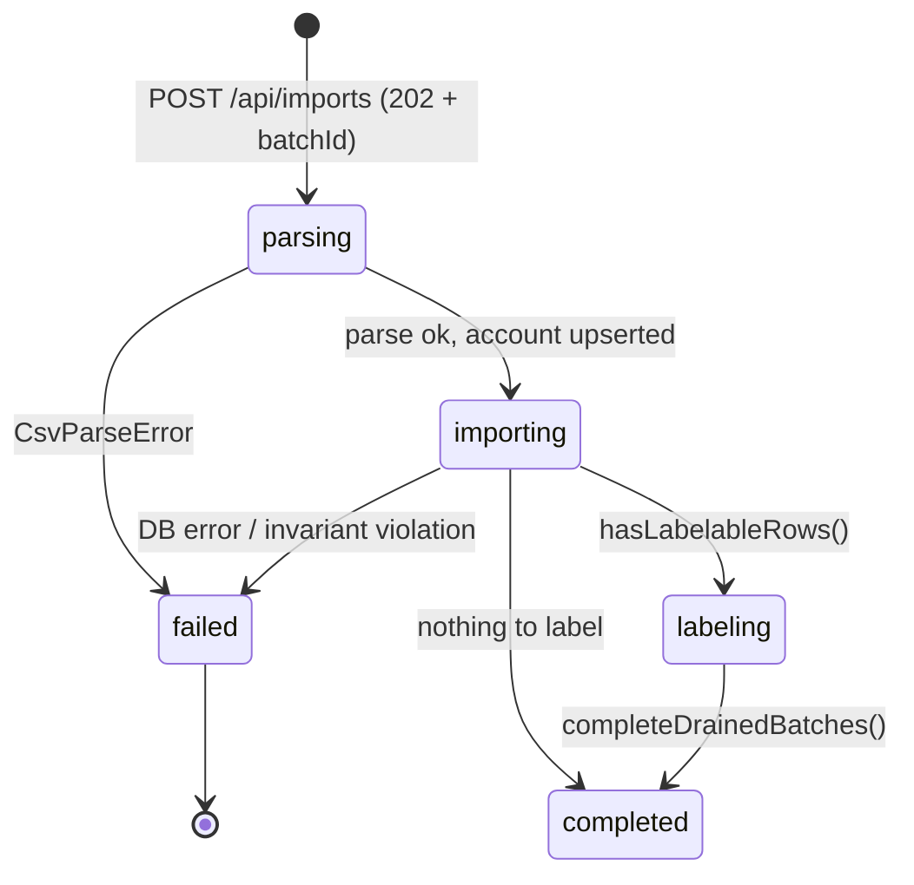

# CSV import

_Last reviewed against v1.8.0._

The import path turns a DKB CSV export into deduplicated, reconciled
transactions and hands them to the label worker. Everything in this guide is
implemented in [lib/csv/parser.ts](../lib/csv/parser.ts),
[lib/money.ts](../lib/money.ts), [lib/db/dedupe.ts](../lib/db/dedupe.ts),
[lib/db/match.ts](../lib/db/match.ts) and
[lib/import/pipeline.ts](../lib/import/pipeline.ts).

The canonical format reference is [template.csv](../template.csv) — an
anonymized real DKB export. All parsing rules below were derived from real
exports and verified against it.

## The DKB CSV format

- Semicolon-delimited, **UTF-8 with BOM**.
- **Preamble before the header** (data rows are padded with trailing
  semicolons):
  1. `Girokonto;DE02120300000000202051;…` — account name + IBAN
  2. `Zeitraum:;…` — export period, **intentionally ignored** (unreliable format)
  3. `Kontostand vom 17.01.2026:;1.234,56 €` — snapshot date + amount (the
     balance anchor, see [analytics.md](analytics.md))
- **Header row**: `Buchungsdatum;Wertstellung;Status;Zahlungspflichtige*r;Zahlungsempfänger*in;Verwendungszweck;Umsatztyp;IBAN;Betrag (€);Gläubiger-ID;Mandatsreferenz;Kundenreferenz` —
  all 12 are required (see [glossary](README.md#glossary)).

Parsing choices ([ADR-0003](adr/adr-0003-fail-fast-csv-parsing.md)):

- PapaParse with `delimiter: ";"`, `header: false`, `skipEmptyLines: "greedy"`;
  BOM stripped explicitly.
- The header row is located by **exact cell match**, never raw line search —
  quoted preamble fields could contain the marker text.
- Columns are mapped **by header name, not position**, for robustness against
  DKB reordering columns.
- The preamble is parsed for account identity and the snapshot; `peekDkbCsvAccount()`
  does a synchronous 10-row scan used by the upload route **before any DB
  write** so a bad file creates no orphan rows.

## German money and date parsing

[lib/money.ts](../lib/money.ts) is the correctness core of the app: every
cent that shows up in analytics flows through `parseGermanAmountToCents()`.

Disambiguation rules for `Betrag (€)` values:

| Input shape                            | Rule                                | Example             |
| -------------------------------------- | ----------------------------------- | ------------------- |
| `.` and `,` both present               | dot = thousands, comma = decimal    | `1.234,56` → 123456 |
| only `,`                               | comma is decimal separator          | `-51,17` → -5117    |
| only `.`, all groups 3 digits          | dot is thousands separator          | `-1.074` → -107400  |
| only `.`, one dot, 1–2 trailing digits | decimal point                       | `-1.03` → -103      |
| otherwise                              | **rejected** (ambiguous, fail fast) | `12.345.6` → error  |

Additional rules: leading or trailing `-` makes the value negative; currency
symbols, NBSP/narrow-NBSP (`\u00A0`, `\u202F`), and whitespace are stripped;
sub-cent fractions (>2 digits) are rejected because no real DKB export has
them; the result must be a `Number.isSafeInteger`. Dates are `DD.MM.YY` /
`DD.MM.YYYY` with a 2-digit-year pivot at 80 and real month-length
validation. `formatCentsAsGerman()` is the round-trip formatter used by the
property tests ([ADR-0020](adr/adr-0020-property-tests-money.md)).

## Import pipeline

1. **Upload** — `POST /api/imports` (multipart, ≤ 25 MB): size/empty checks,
   `peekAccount()` preamble validation, then `startImport()` → **202 with
   `batchId` immediately**. A concurrent import returns **409**
   ([ADR-0010](adr/adr-0010-single-flight-import.md)).
2. **`parsing`** — background job inserts the batch row, runs the full
   `parseDkbCsv()`. Fail-fast: the first unparseable row aborts the whole
   import (full retention makes lenient parsing unrecoverable) and the batch
   is marked `failed` with a row-numbered error.
3. **`importing`** — the account is upserted by IBAN **after** successful
   parse (no orphan accounts), then `runReconcileAndDedupeStage()` runs
   deletes/updates/inserts in **one transaction**, with the invariant
   `imported + duplicateCount + updatedCount === totalRows` asserted.
4. **`labeling`** — if any booked rows need labels, the batch status flips to
   `labeling` and the worker takes over ([labelling.md](labelling.md));
   otherwise the batch is `completed` immediately and orphan categories are
   pruned.
5. **Startup recovery** — a restart marks batches stuck in `parsing`/`importing`
   as `failed`; `labeling` batches resume ([ADR-0011](adr/adr-0011-startup-recovery.md)).

## Occurrence-aware dedupe

Re-importing overlapping exports must never delete or duplicate rows —
including _identical same-day transactions_ (two coffees at 3,50 € are two
rows, not one) ([ADR-0006](adr/adr-0006-occurrence-aware-dedupe.md)).

- **Content hash** — SHA-256 over `hashVersion | accountIban | bookingDate |
valueDate | amountCents | payer | payee | purpose | type | status |
creditorId | mandateRef | customerRef`, joined with `|`. Both party names
  are included (a direction-dependent counterparty would be ambiguous); the
  hash is account-scoped to prevent cross-account merges. `HASH_VERSION = 1`
  is stored per row so the hash shape can evolve.
- **Multiset union** — for each hash, if the file contains N rows and the DB
  already has E, the first `min(N, E)` are duplicates and `N - E` are
  inserted at occurrence indices `[E, N)`. The unique index
  `(account_id, source_hash, occurrence_index)` enforces this; `onConflictDoNothing`
  defends the insert.
- Re-importing the same file inserts nothing; overlapping exports insert only
  the surplus; **transactions are never deleted on re-import**.

## Fuzzy reconciliation

DKB exports evolve: pending (`Nicht gebucht`) rows later re-export as booked
(`Gebucht`), sometimes ±a few days, sometimes with re-rendered payee names.
The reconcile stage ([lib/db/match.ts](../lib/db/match.ts)) classifies
incoming rows against the DB before dedupe
([ADR-0007](adr/adr-0007-fuzzy-reconciliation.md)):

| Match kind | Meaning                                 | Effect                                                                                               |
| ---------- | --------------------------------------- | ---------------------------------------------------------------------------------------------------- |
| `upgrade`  | incoming `Gebucht` ↔ DB `Nicht gebucht` | DB row **updated in place** (new content, fresh hash + occurrence slot), re-pointed to the new batch |
| `skip`     | incoming `Nicht gebucht` ↔ DB `Gebucht` | dropped — the booked copy is already stored                                                          |
| `refresh`  | pending ↔ pending, differing content    | DB row refreshed in place                                                                            |

**Viability** (all required): same `type`, same `amount_cents`, same party
identity — equal non-empty `counterparty_iban`, else equal non-empty
`creditor_id`, else equal non-empty `mandate_ref` — and |date difference| ≤
`MATCH_WINDOW_DAYS = 7`.

**Pairing** is a deterministic greedy 1:1 assignment sorted by smallest date
difference → kind rank (`upgrade` before `skip` before `refresh`) → earliest
booking date → ids, so results are reproducible.

**Booked↔booked self-heal** — when DKB changes the payee rendering between
export formats (e.g. `EDEKA.SCHROT/ELXLEBEN` → `EDEKA`), rows with the same
`Kundenreferenz` + amount + type + **exact booking date** are treated as the
same transaction and the older copy is deleted (content differs; the
Kundenreferenz is one generic reference per rent/insurance for recurring SEPA
debits, so the booking date must be part of the identity). A pending↔booked
self-heal also removes stale DB pending rows that duplicate a booked row.

## Live counters

Batch progress (`rows_*` and label counts) is **computed per read** with
`COUNT(*) FILTER (WHERE …)` from live row ownership rather than trusted from
stored columns — re-pointed rows (fuzzy upgrades) and background relabels
never drift the numbers. Invariant: `done + failed + pending('Gebucht') =
total` ([ADR-0019](adr/adr-0019-live-batch-counters.md)).
