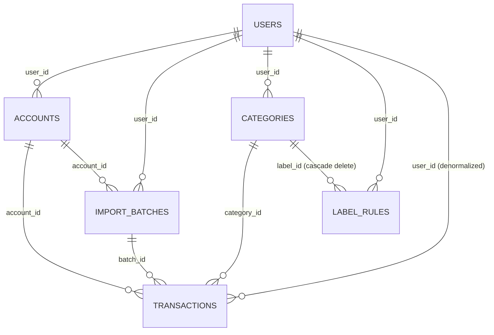

# Data model

_Last reviewed against v1.9.0._

The persistence layer is **SQLite via better-sqlite3, accessed synchronously
through drizzle-orm** (used only as a type-safe query builder — no drizzle-kit
migration files exist). Schema DDL is hand-written, code-first, and idempotent
([ADR-0005](adr/adr-0005-code-first-ddl.md)).

## Connection management

[lib/db/index.ts](../lib/db/index.ts) opens the database in `createDb()`:

1. `fs.mkdirSync` on the parent of `DATABASE_PATH` (default `./data/geldlage.db`).
2. Open better-sqlite3 and set three pragmas:
   - `journal_mode = WAL` — concurrent readers while the worker writes;
   - `foreign_keys = ON` — label-rule cascade deletes depend on this;
   - `busy_timeout = 5000` — API route + label worker share one process but
     can still race on write locks across connections in tests.
3. Wrap in `drizzle(sqlite, { schema })`.

The connection is a **module singleton cached on `globalThis`**
(`globalThis.__geldlageDbHolder`) so dev hot-reloads reuse the handle. `getDb()`
additionally:

- returns the injected test DB when `process.env.VITEST` is set (the seam
  used by the whole test suite, see [testing.md](testing.md));
- re-runs `migrateSchema()` on **every call** — cheap idempotent re-check so
  a hot-reloaded singleton heals a file DB whose schema changed on disk.

Timestamps are **TEXT ISO-8601 strings** (`new Date().toISOString()` via
`$defaultFn`), not epoch integers — human-readable in any SQLite browser and
lexically sortable; the analytics engine slices months with
`substr(booking_date, 1, 7)` on exactly this format.

## Tables

Six tables ([lib/db/schema.ts](../lib/db/schema.ts)); every domain table
carries `user_id` — rows are invisible to other users
([ADR-0032](adr/adr-0032-multi-user-oidc.md)):

### `users`

JIT-provisioned on first OIDC login ([ADR-0032](adr/adr-0032-multi-user-oidc.md)).

| Column       | Type          | Notes                                           |
| ------------ | ------------- | ----------------------------------------------- |
| `id`         | INTEGER PK    | autoincrement; the `user_id` stamped everywhere |
| `issuer`     | TEXT NOT NULL | OIDC issuer URL                                 |
| `subject`    | TEXT NOT NULL | OIDC `sub` claim                                |
| `name`       | TEXT NOT NULL | from the ID token (updated on next login)       |
| `email`      | TEXT NOT NULL | from the ID token (updated on next login)       |
| `created_at` | TEXT          | ISO                                             |

Unique index: `users_issuer_subject_unique` on `(issuer, subject)`.

### `accounts`

| Column       | Type          | Notes                                         |
| ------------ | ------------- | --------------------------------------------- |
| `id`         | INTEGER PK    | autoincrement                                 |
| `user_id`    | INTEGER FK    | owning user                                   |
| `iban`       | TEXT NOT NULL | unique **per user**; uppercased at parse time |
| `name`       | TEXT NOT NULL | from the CSV preamble (`Girokonto;…`)         |
| `created_at` | TEXT          | ISO                                           |

Unique index: `accounts_user_iban_unique` on `(user_id, iban)` — two users
importing the same IBAN get fully separate accounts.

### `import_batches`

One row per CSV upload; drives the progress UI.

| Column                                                       | Type           | Notes                                                                                                                         |
| ------------------------------------------------------------ | -------------- | ----------------------------------------------------------------------------------------------------------------------------- |
| `id`                                                         | TEXT PK        | UUID                                                                                                                          |
| `user_id`                                                    | INTEGER FK     | owning user                                                                                                                   |
| `file_name`                                                  | TEXT           | original upload name                                                                                                          |
| `account_id`                                                 | INTEGER FK     | nullable until parse succeeds                                                                                                 |
| `status`                                                     | TEXT           | state machine: `parsing → importing → labeling → completed`, plus `failed` ([ADR-0010](adr/adr-0010-single-flight-import.md)) |
| `error`                                                      | TEXT           | failure reason                                                                                                                |
| `snapshot_date` / `snapshot_amount_cents`                    | TEXT / INTEGER | `Kontostand` preamble line; the balance anchor ([analytics.md](analytics.md))                                                 |
| `rows_total / rows_imported / rows_duplicate / rows_updated` | INTEGER        | import stage counters                                                                                                         |
| `labels_total / labels_done / labels_failed`                 | INTEGER        | recorded counters — **read paths use live COUNT queries instead** ([ADR-0019](adr/adr-0019-live-batch-counters.md))           |
| `created_at / updated_at / completed_at`                     | TEXT           |                                                                                                                               |

Index: `import_batches_status_idx` on `status`.

### `categories`

The label vocabulary ("Kategorien" in the UI).

| Column        | Type       | Notes                                                                                                           |
| ------------- | ---------- | --------------------------------------------------------------------------------------------------------------- |
| `id`          | INTEGER PK |                                                                                                                 |
| `user_id`     | INTEGER FK | owning user (labels are per user)                                                                               |
| `name`        | TEXT       | display name, ≤ 64 UTF-8 bytes, prompt-marker-free ([ADR-0017](adr/adr-0017-marker-neutralization-symmetry.md)) |
| `nameKey`     | TEXT       | normalized lookup key: trim, lowercase, collapsed spaces; unique per user                                       |
| `language`    | TEXT       | from `LLM_LANGUAGE`                                                                                             |
| `origin`      | TEXT       | `llm` (invented by the model) or `manual` (user-created/renamed/assigned); decides prune behavior               |
| `usage_count` | INTEGER    | bumped on apply/assign events — not a live transaction count                                                    |
| `color`       | TEXT       | permanent unique display color (oklch); NULL only as legacy fallback, unique index `categories_color_unique`    |

### `label_rules`

Learned suggestions, keyed on the **verbatim triple**:

| Column                                  | Type                    | Notes                                            |
| --------------------------------------- | ----------------------- | ------------------------------------------------ |
| `user_id`                               | INTEGER FK → users      | owning user                                      |
| `label_id`                              | INTEGER FK → categories | `ON DELETE CASCADE`                              |
| `payer` / `payee` / `counterparty_iban` | TEXT NOT NULL           | exact CSV values, never empty (`CHECK(x <> '')`) |
| `created_at`                            | TEXT                    |                                                  |

Unique index **`(user_id, payer, payee, counterparty_iban)`** makes matching
at-most-one-rule-per-triple-per-user by construction. See
[ADR-0018](adr/adr-0018-verbatim-triple-rule-keys.md).

### `transactions`

| Column                                                               | Type                 | Notes                                                                                |
| -------------------------------------------------------------------- | -------------------- | ------------------------------------------------------------------------------------ |
| `id`                                                                 | TEXT PK              | UUID                                                                                 |
| `user_id`                                                            | INTEGER FK NOT NULL  | denormalized from the account for single-`WHERE` scoping                             |
| `account_id`                                                         | INTEGER FK NOT NULL  |                                                                                      |
| `batch_id`                                                           | TEXT FK              | nullable — UUID of `import_batches.id`                                               |
| `booking_date` / `value_date`                                        | TEXT NOT NULL / TEXT | ISO dates                                                                            |
| `status`                                                             | TEXT                 | `Gebucht` or `Nicht gebucht`, verbatim from DKB                                      |
| `payer` / `payee` / `purpose`                                        | TEXT                 | nullable, whitespace-normalized at parse time                                        |
| `type`                                                               | TEXT NOT NULL        | `Ausgang` / `Eingang`                                                                |
| `counterparty_iban` / `creditor_id` / `mandate_ref` / `customer_ref` | TEXT                 | reconciliation identity fields                                                       |
| `amount_cents`                                                       | INTEGER NOT NULL     | signed integer cents ([ADR-0002](adr/adr-0002-integer-cents.md))                     |
| `category_id`                                                        | INTEGER FK           | nullable — null = not yet labeled or failed                                          |
| `label_status`                                                       | TEXT                 | `pending / labeled / failed`                                                         |
| `label_attempts`                                                     | INTEGER              | incremented at claim time ([ADR-0014](adr/adr-0014-claim-time-attempt-increment.md)) |
| `source_hash`                                                        | TEXT NOT NULL        | SHA-256 content hash ([ADR-0006](adr/adr-0006-occurrence-aware-dedupe.md))           |
| `occurrence_index`                                                   | INTEGER              | multiset slot for identical transactions                                             |
| `hash_version`                                                       | INTEGER              | `1`; lets the hash shape evolve without breaking old rows                            |

Indexes: `transactions_dedupe_unique` UNIQUE `(account_id, source_hash,
occurrence_index)` — the dedupe linchpin — plus `account_booking`,
`booking_date`, `label_status` (worker claim scan), `batch_id`, `category`,
`payee`.

## Schema creation and migration

No migration files exist. Two functions in [lib/db/index.ts](../lib/db/index.ts)
cover the whole lifecycle ([ADR-0005](adr/adr-0005-code-first-ddl.md)):

1. **`createSchemaSqlite(db)`** — `CREATE TABLE IF NOT EXISTS` +
   `CREATE INDEX IF NOT EXISTS` DDL mirroring the drizzle schema exactly
   ("drizzle-kit push equivalent, code-first"). Runs on first `getDb()`.
2. **`migrateSchema(db)`** — `PRAGMA table_info` introspection +
   conditional `ALTER TABLE ADD COLUMN` for columns added to existing tables
   (`import_batches.rows_updated`, `categories.origin`,
   `categories.usage_count`); re-checked on every `getDb()`.

The drizzle `check()` definitions on `label_rules` exist only for
drizzle-kit push parity and must stay in sync with the hand-written DDL.

### The destructive `label_rules` rebuild

When a `label_rules` table exists but lacks `counterparty_iban` (pre-v1.8.0
shape `(iban, name_key)`), `migrateSchema` **drops and recreates** it. This
was the v1.8.0 breaking change: old learned rules are discarded. Rules are
cheap — they regenerate automatically as users re-assign labels — so a
destructive migration was cheaper than a data-mapping path. The behavior is
regression-tested against a real file DB in
[tests/db-migration.test.ts](../tests/db-migration.test.ts) (see
[testing.md](testing.md)).

## Design decisions and tradeoffs

- **better-sqlite3 over an embedded server or ORM-managed DB** — synchronous,
  fast, zero-admin, perfect for a local single-user app; WAL covers the
  API/worker concurrency within one process
  ([ADR-0004](adr/adr-0004-better-sqlite3-wal-singleton.md)).
- **Drizzle as query builder only** — type safety without a migration
  runtime; the schema is code-first DDL that never drifts from a migration
  folder because there isn't one ([ADR-0005](adr/adr-0005-code-first-ddl.md)).
- **TEXT ISO timestamps** — sortable, debuggable, `substr`-able for month
  grouping; costs a few bytes per row and needs no epoch math.
- **Counters recomputed live** — stored `labels_*` columns exist for the
  history table, but the progress UI reads `COUNT(*) FILTER (WHERE …)` so
  re-pointed rows (fuzzy updates) and background relabels never drift the
  numbers ([ADR-0019](adr/adr-0019-live-batch-counters.md)).

## Glossary of stored values

Verbatim DKB vocabulary stored in these tables is translated in the
[glossary](README.md#glossary) of the docs index.
