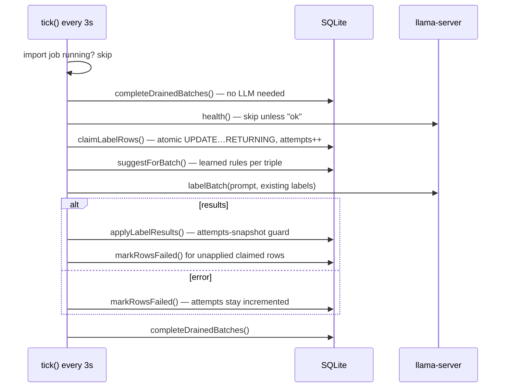

# Labelling

_Last reviewed against v1.8.0._

Transaction categorization runs as a background worker loop that claims
pending rows in small batches, asks a local llama.cpp `llama-server` for
labels, and persists results with crash-safe bookkeeping. Code:
[lib/labeller/worker.ts](../lib/labeller/worker.ts),
[lib/labeller/service.ts](../lib/labeller/service.ts),
[lib/llm/client.ts](../lib/llm/client.ts), [lib/llm/prompt.ts](../lib/llm/prompt.ts),
[lib/labels/matching.ts](../lib/labels/matching.ts).

## The worker loop

`startLabelWorker()` is called from instrumentation at server boot; the tick
interval is 3 s (both initial `setTimeout` and `setInterval` are `.unref()`ed
so they never hold the process open).

Any unexpected error is logged and swallowed — never kills the loop.

## Claim semantics

`claimLabelRows()` (worker.ts) is an atomic `UPDATE … RETURNING` that
selects up to `LLM_BATCH_SIZE` rows where `label_status IN ('pending',
'failed')`, `status = 'Gebucht'`, and `label_attempts < LLM_MAX_ATTEMPTS`
([ADR-0014](adr/adr-0014-claim-time-attempt-increment.md)):

- **Claim flips nothing.** Rows keep their status until results are written;
  incrementing `label_attempts` at claim time makes a crash between claim and
  write safe — the row is retried next tick until the attempts cap.
- Only booked transactions are ever labeled.
- The claimed **attempts snapshot** (`Map<id, attempts>`) is the concurrency
  guard: if the value changed by apply time, the row was reset meanwhile
  (concurrent fuzzy update, retry endpoint, manual assignment) and its stale
  LLM result must not be applied — the manual action wins.

## Health gate

Before claiming, `tick()` calls `client.health()` (a cheap `GET /health`
probe with a 5 s timeout, classified `ok / degraded / unreachable`) and skips
the tick unless `"ok"` ([ADR-0015](adr/adr-0015-health-gate.md)). Without it,
an LLM outage would burn every row's attempt budget on timed-out claims and
leave rows unclaimable until manual retry. The same probe backs
`GET /api/llm/health` and the header health badge.

## LLM client

[lib/llm/client.ts](../lib/llm/client.ts) POSTs OpenAI-compatible chat
completions to `${LLM_BASE_URL}/v1/chat/completions`
([ADR-0012](adr/adr-0012-local-llama-server.md)):

- `temperature: 0` — deterministic output; a deterministic truncation would
  otherwise burn every attempt identically.
- `max_tokens: max(1024, items.length * 96)` — labels cap at 64 UTF-8 bytes
  plus index overhead; the old 24/item budget truncated large batches
  mid-JSON.
- **Grammar-constrained decoding**: `response_format: { type: "json_schema" }`
  with a schema that bounds the array to exactly `itemCount` items and the
  echoed `index` to `[0, itemCount-1]` — the grammar itself cannot produce
  out-of-range indices ([ADR-0016](adr/adr-0016-grammar-constrained-decoding.md)).
- **Client-side context budget guard**: llama-server clamps output silently
  at its context window; the client estimates tokens as `chars/4` and warns
  once per request when `promptTokens + max_tokens > LLM_CTX`, pointing the
  operator at `LLM_BATCH_SIZE` / `LLM_CTX` (both sides must be raised).

**Retry taxonomy** (ported from a Rust client,
[ADR-0016](adr/adr-0016-grammar-constrained-decoding.md)):

| Failure                                                     | Behavior                                        |
| ----------------------------------------------------------- | ----------------------------------------------- |
| Timeout (`AbortSignal.timeout`, incl. mid-body-read stalls) | **never retried** — thrown as `LlmTimeoutError` |
| Network error                                               | retried (like backend-down)                     |
| HTTP 429 / ≥5xx                                             | retried                                         |
| Other HTTP status                                           | immediate `LlmHttpError`                        |
| Malformed payload (missing content, unparseable JSON)       | retried like 5xx                                |

Backoff: `200ms · 4^(attempt-1) + jitter [0, 50ms]`, capped by
`LLM_MAX_RETRIES` (default 2). On timeout the caller marks claimed rows
failed — there are no fallback labels
([ADR-0013](adr/adr-0013-no-fallback-labels.md)).

**Response association**: a model-echoed integer `index` in range pins the
label to that slot; entries without an index fill the next open slot;
out-of-range indices are dropped, not shifted; first valid label per slot
wins; unfilled slots are omitted — the caller decides (mark failed).

**Label sanitizing** — trim, collapse whitespace, drop control chars,
neutralize prompt markers, cap at 64 UTF-8 bytes. Marker neutralization is
deliberate: a stored label renders back into the prompt byte-for-byte (see
[ADR-0017](adr/adr-0017-marker-neutralization-symmetry.md)).

## Prompt construction

- **System prompt** (`systemPrompt()`): role, JSON output contract, label
  language from `LLM_LANGUAGE` (12 languages mapped by name), 1–3 words / no
  punctuation / sentence case, categorize _by what the transaction is for,
  not by its wording_. The top `LLM_MAX_LABELS_PROMPT` (200) existing labels
  by usage are injected with the rule "must reuse a fitting label exactly as
  written; only invent when none fits" (`0` disables injection).
- **User prompt** (`userPrompt()`): one line per transaction —
  `[i] date=…; amount=…; currency=EUR; counterparty=<<…>>; purpose=<<…>>;
suggested_labels=<<a | b>>`. The `<<`/`>>` are deliberate delimiters; `|`
  separates suggestions (and is neutralized inside values).
- **Marker neutralization symmetry**: input fields (`sanitizeField()`) and
  model output (`sanitizeLabel()`) share `neutralizeMarkers()` — `<<`/`>>`
  runs collapse to single chars iterating to a fixed point (a single pass
  only halves odd runs like `a<<<b`), `index=` becomes `index `, `|` becomes
  `/`. Without this, a label containing `|` would create phantom duplicate
  categories on every reuse ([ADR-0017](adr/adr-0017-marker-neutralization-symmetry.md)).
- Field truncation: 512 UTF-8 bytes, cut on continuation-byte boundaries.

## Label rules (learned suggestions)

Manual assignment in the transactions table **learns a rule** from the exact
`(payer, payee, counterparty_iban)` triple → label
([ADR-0018](adr/adr-0018-verbatim-triple-rule-keys.md)):

- **Verbatim keys** — values are stored and compared exactly as the CSV
  parser normalized them; only non-empty triples are usable.
- **Newest wins** — re-learning the same triple for a new label replaces the
  rule; the unique index on the triple guarantees at most one rule per key.
- **In the loop** — claimed rows get suggestions injected into the prompt;
  the LLM decides but must reuse a fitting suggestion character-for-character.
- **Apply to existing data** — `applyRuleToTransactions()` sets
  `categoryId` on matching booked rows immediately (visible in the UI) but
  resets them to `pending, attempts 0` so the worker re-labels them with the
  rule injected as a suggestion — the model confirms the final label.
  Rows already carrying the rule's label are excluded.

## Completion, failure, and deletion semantics

- **`applyLabelResults()`** — one transaction; re-reads each row and skips if
  attempts changed since claim; resolves/creates the category via the single
  choke point `resolveAndUseCategory()` (normalizes the name to `nameKey`,
  bumps `usage_count`); sets `label_status: 'labeled'` and **resets
  `label_attempts: 0`**.
- **`markRowsFailed()`** — skips rows already labeled and rows whose attempts
  changed since claim; attempts stay incremented (that is the accounting).
- **`completeDrainedBatches()`** — a single SQL update completing batches in
  `labeling` when no transaction is `Gebucht + pending + attempts < cap`.
  Three deadlock-avoidance rules: the `Gebucht` filter prevents deadlock for
  all-pending batches; failed rows never block; attempt-exhausted rows don't
  block (the retry endpoint can revive them with a fresh budget).
- **`pruneOrphanCategories()`** — deletes only `origin = 'llm'` categories
  with no transactions and no learned rules; manual labels and rule-referenced
  labels survive (user intent is never silently destroyed).
- **Label deletion** — resets carrying transactions to
  `pending / attempts 0`, re-points completed owning batches back to
  `labeling`, refreshes `labels_total`, and lets the FK cascade remove the
  label's rules — all in one transaction (see [api.md](api.md),
  `DELETE /api/labels/[id]`).
- **Manual retry** — `POST /api/labels/retry` resets `failed`/pending rows
  with `attempts >= cap` to `pending / attempts 0`; the worker already
  re-claims failed rows below the cap.

## Name validation

`isValidLabelName()` rejects names that are empty, over 64 UTF-8 bytes, or
contain control characters — and any name that does not survive
`sanitizeField()` unchanged. A stored name containing `|` or `<<` could never
normalize back to its own `nameKey` and would create a phantom duplicate
category on every reuse ("Miete | Nebenkosten" renders as "Miete /
Nebenkosten"). The round-trip check subsumes the marker list, so it cannot
drift if the sanitizer's rewrite set ever changes.
